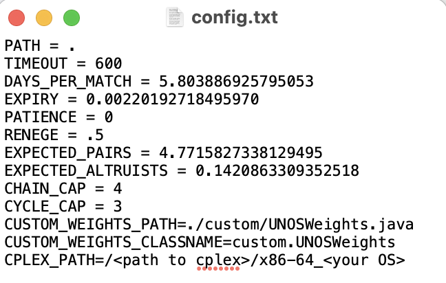
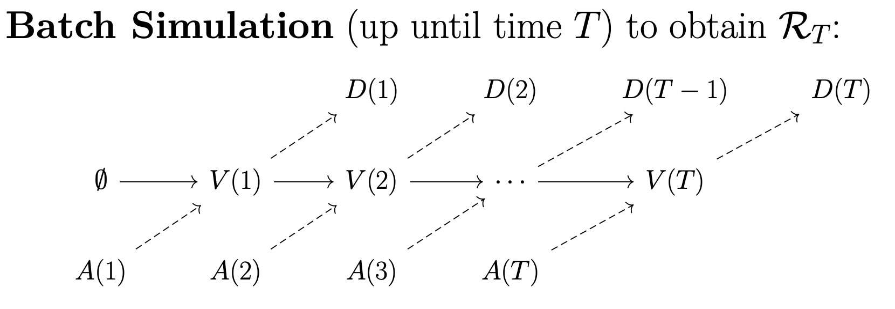
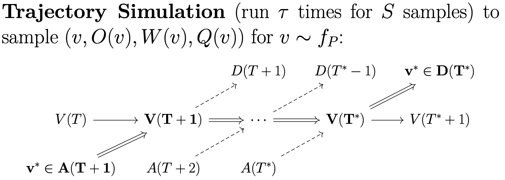

# Simulators
{: .no_toc }

## Table of contents
{: .no_toc .text-delta }

1. TOC
{:toc}

---
## Configuration

OpenKPD has a number of parameters that can be set through a configuration file. In the download release, this file is `config.txt`, as shown below.



The following parameters are relevant for both the Batch Simulator and Trajectory Simulator. By default, all constants are set to corresponding to data collected from the UNOS exchange:

| Configuration Variable | Description |
| :---: | :--- |
| `PATH`| sets the directory where OpenKPD output files will be written |
| `DAYS_PER_MATCH` | sets the policy match frequency, or the number of days patients wait until another round of matching begins |
| `EXPIRY`| sets the probability of patient expiry per round of matching |
| `PATIENCE`| sets the per-round probability that an altruistic donor runs out of patience and leaves the exchnage prior to being matched |
| `RENEGE` | sets the probability that a bridge donor reneges in a chain |
|`EXPECTED_PAIRS` | sets the expected number of pairs that arrives in the exchange each round |
| `EXPECTED_ALTRUISTS`| sets the expected number of altruists that arrives in the exchange each round |
| `CHAIN_CAP` | sets the maximum length of any chain in the integer program used to find matches |
| `CYCLE_CAP` | sets the maximum length of any cycle in the integer program used to find matches |
| `CPLEX_PATH` | links CPLEX to OpenKPD. See [Installation](https://openkpd.org/docs/installation/) for more information |

By default, OpenKPD will run the [UNOS matching policy](https://optn.transplant.hrsa.gov/media/3239/20191011_kidney_kpd_priority_points.pdf), and patients will arrive according to a distribution that was inferred using real UNOS data. The policy can be customized using the techniques described in the [Policy Customization](https://openkpd.org/docs/customization/) section of the documentation. The parameters `CUSTOM_WEIGHTS_PATH` and `CUSTOM_WEIGHTS_CLASSNAME` are used to set a custom policy.


## Batch simulation

OpenKPD comes with two packaged simulators. The first of which is the _batch simulator_, which can be used to generate a simulated match record. By match record, we refer to a running list that contains the features of every patient that has entered the exchange, along with their match outcome (i.e. was the patient matched, and if so how long did it take and what was the organ quality). 




The batch simulator takes one argument: the number of days to simulate. It returns three objects. First, it outputs a file `data.csv` which consists of a list of patients that exited the exchange, along with their outcomes. Next, it returns two objects: `terminal.pool` and `terminal.poolgen`. These latter two files can be used to sample patient trajecgtories that begin at the end of batch simulation (see [Trajectory simulation](#trajectory-simulation) for more information). 

To run the batch simulator, open a terminal in the same directory as `OpenKPD.jar` and enter the following command:

```
java -jar OpenKPD.jar batch <config> <days>
```

where `<config>` points to your configuration file as shown in [Configuration](#configuration), and `<days>` is the number of days to simulate.


## Trajectory simulation

Whereas batch simulation samples patient outcomes for those exiting the exchange, trajecory simulation samples patient outcomes for those entering the exchange. Starting from some initial pool, the trajectory simulator will sample some number of patients, and simulate the pool until the patient exits the pool for some number of trajectories.



Trajectory simulation occurs in two hierarchical steps. First, we require a subprocess that simulates a given patient from some starting pool state for some number of trajectories. Next, that subprocesses must be run multiple times to obtain a collection of trajectories for a collection of patients. OpenKPD allows users to run the first subprocess out-of-the-box using the `sample` command. 

To do so, as before, open a terminal in the same directory as `OpenKPD.jar` and enter the following command: 

```
java -jar OpenKPD.jar sample <config> <trajectories> <pool> <sampleID>
```

where 

| Variable | Description|
| :---: | :-- |
|`<config>`| points to your configuration file as shown in [Configuration](#configuration)|
| `<trajectories>` | the number of trajectories that should be run for the sample |
| `<pool>` | path to the `.pool` and `.poolgen` files generated via [Batch Simulation](#batch-simulation) (e.g. if batch simulation outputted `terminal.pool` and `terminal.poolgen` in the current directory, then we should set `<pool>` to `./terminal`) |
| `<sampleID>` | used to name the output file -- the output of this command will be a cSV file named `sample<sampleID>.csv` containing a list of the simulated trajectory outcomes|

Due to their biological features, certain patients are unfortunately never matched in the exchange. If such a patient is sampled, it can take a long time for the `sample` command to terminate. To mitigate this, the `TIMEOUT` variable can be set in the [configuration file](#configuration), which limits the number of matching rounds per trajectory to a specified quantity.

### Naive parallelism with SLURM

To obtain trajectories for many patients, we have to run the `sample` command many times. As each run can be time-consuming, we may want to reduce the time complexity by running many `sample` commands in parallel on a compute cluster. Below, we give code to do this on a SLURM compute cluster, which runs the `sample` command 300 times with 500 trajectories each:

``` 
#!/bin/bash
#
#SBATCH --job-name=kidneys
#SBATCH --output=out.txt
#SBATCH --ntasks=1
#SBATCH --time=10-0
#SBATCH --mem-per-cpu=16384
#SBATCH --array=1-300

srun java -jar OpenKPD.jar sample config.txt 500 ./terminal $SLURM_ARRAY_TASK_ID
```

This will generate 300 CSV files titled `sample(0-299).csv`, where each CSV file contains 500 entries consisting of the sampled patient's trajectory outcomes. 